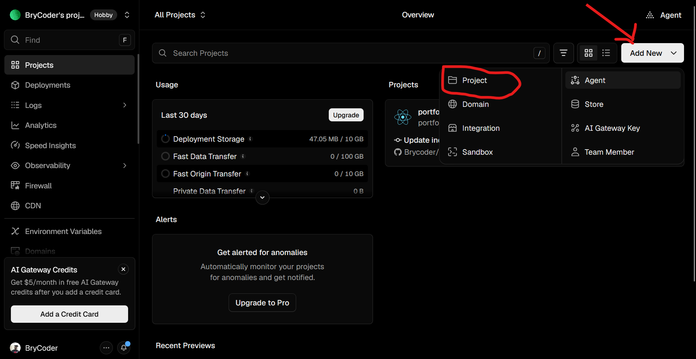
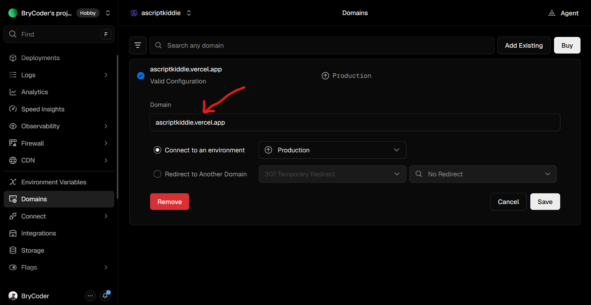

Hey There,
Before you begin, it is highly recommended that you customize this portfolio on a **laptop or medium-to-large screen device**.

## 🖥️ Setup Recommendation

For the smoothest experience, it is recommended that you have 2 browser tabs open side-by-side while customizing the portfolio.

🪟 Windows Users / 🐧 Linux Users

1. Open one tab for reading these instructions.
   
      Then press on your keyboard:
   
          Windows/Super Key + ← (left arrow key)  **Press both at the same time**
      
      This will show instructions to the left side of your screen.

2. Open a second tab for editing the code.
   
      Then press on your keyboard:
   
         Windows/Super Key + → (right arrow key)   **Long press windows/super key then click once on the arrow key **
            
      This will show instructions to the right side of your screen.

🍎 macOS Users

1. Open one tab for reading these instructions.

      Hover over the green fullscreen button at the top-left corner of the window.

      Then choose:

         Tile Window to Left of Screen
   
2. Open your second tab or code editor.

      Select:

         Tile Window to Right of Screen
   
      macOS will automatically place both windows side-by-side.

---

# 🚀 Portfolio Deployment & Setup Guide

Before we can customize anything, we first need to get your portfolio deployed online.

This portfolio is built using **React**, which means it needs a hosting platform to properly build and deploy the code.

We’ll be using **Vercel** because it’s beginner-friendly, fast, and works perfectly with React applications.

---

✨ Step 1: Forking The Portfolio

Locate the `Fork` button on the GitHub repository page just like shown in the images below.

Then:

* Click the Fork button
* Confirm the fork creation

The images below give you a guide.

Once complete, you should now have the portfolio saved under your own GitHub account.

✨ Step 2: Open Repository Settings

Once your fork has been created, locate the `Settings` button near the top of the repository page just like shown in the image below.

Click it.

Inside the Settings page:

Scroll all the way to the bottom and locate the section called `Danger Zone` like shown in the image below and select `Leave Fork Network`

Accept the terms and conditions, pass the security check and leave the fork network.

This disconnects your repository from the original fork network and makes your portfolio completely yours.

✨ Step 3: Create A Vercel Account

First, open:

[Vercel](https://vercel.com)

I’ve attached an image below showing what the homepage looks like, but is subject to change with improvements from the organization.

---

## ⚠️ Important

Without doing this step, the instructions below will not work properly because the portfolio needs Vercel to deploy the React application.

When creating your account:

* Use the **same GitHub account** that contains your portfolio repository
* This makes importing and deploying your portfolio significantly easier

---

✨ Step 4: Connect GitHub To Vercel

Make sure your signed in with your same GitHub email that contains the portfolio. Once logged into Vercel, locate the section called:

      Import Git Repository or Add New Project

I’ve attached an image below showing where this is located.

OR

Connect your GitHub account inside the **Import Git Repository** section:

1. Connect your GitHub account to Vercel
2. You should now see an **Install** button appear
3. Click the **Install** button like shown in the image below

After installing GitHub all of your repositories should now appear underneath the:

      Import Git Repository

section. Locate the specific portfolio repository and import it.

---

✨ Step 5: Choose Your Domain Name

Before deploying, you can customize your domain name to whatever you want.

For example:

      cyberkay  or  alexportfolio

Then click the: Deploy button. ⚠️ Don’t Panic If You Get Errors

If you immediately see a:

* 🔴 Red dot = deployment error
* 🟢 Green dot = successful deployment

then don’t worry. If you received a green dot or a successful deployment, you can skip the next step. 

Step 6 is the troubleshooting step if your code didn't deploy. If you received a red dot, continue below.

---

✨ Step 6: Fixing Deployment Errors (TROUBLESHOOTING)

Click the:

      Go To Projects

Locate "Environment Variables" on the left-hand sidebar, find this:

      Environment Variables

like shown in the image below then click:

      Add Environment Variable

Now add the first environment variable. A new panel should appear. Fill in the fields exactly like this:

### Key

      CLI

### Value

      false

Then click: Save

Now add the second environment variable by using the same step and clicking `Add Environment Variable` 

### Key

      CI

### Value

      false

Then click: Save

Once both environment variables have been added, click the: Redeploy button.

You can redeploy in two ways:

Option 1: Use the redeploy button shown on the deployment page.

Option 2: 

* Select: Deployments from the left-hand sidebar
* Open the failed deployment/error message
* Click: Redeploy in the top corner

---

✨ Step 7:  Opening Your Portfolio

Once deployment succeeds, you should now be able to open your portfolio using any of the generated Vercel domains shown on the screen.

---

✨ Step 8: Changing Your Domain Name Later (OPTIONAL)

If you want to change your domain name later:

Select: "Domains" from the left-hand sidebar then click, Edit like shown in the image below

Enter your preferred domain name, just make sure it ends with this, just like the image below:

      .vercel.app

Click: Save. 

If Vercel gives you a confirmation prompt like the one below, any of the two option should work fine.

If by any chance you encountered a strange error not on this README or accidentally deleted all domains or something important you can always start a fresh or post your error in <a href="https://www.skool.com/bree-1280/about" target="_blank" rel="noopener noreferrer"> The Black Widow Community</a> and we'll help you solve it.

---

# 🎉 Perfect: Setup Complete

That’s it 🎉

Your portfolio should now be successfully deployed online and ready to customize.

From this point forward, all of the customization instructions in this README should work correctly.

# 🛠️ Troubleshooting Tips

If your code ever stops working or something breaks:

Head over to the Vercel platform and check:

      Deployment Build Logs

Vercel usually gives very helpful error messages explaining what caused the problem. And of course, feel free to ask <a href="https://www.skool.com/bree-1280/about" target="_blank" rel="noopener noreferrer"> The Black Widow Community</a> for some help along the way.

---

This portfolio was built to be easy to personalize, even if you’re a beginner. Don’t worry if some of this feels new at first, you only need to change a few lines to make the portfolio feel completely yours.

---

## 🏠 Home Page Customization

✨ Step 1: Open the Correct File

To customize the Home Page, locate this file inside the project:
      
          src/components/Home/Home.js
      
Yes, the file is called **Home.js**. This is where the main landing page text is edited.

Once you have the `Home.js`file open, click this editing icon on the screen,

---

✨ Step 2: Customizing the Greeting Wave

Inside `Home.js`, you will see a commented instruction between **line 19** and **line 21**.

It will ask you to choose a skin tone for the waving hand emoji.

Choose **ONLY ONE** of these:

      👋👋🏻👋🏼👋🏽👋🏾👋🏿

Please select **only one emoji**.

If multiple emojis are chosen, the code may not work correctly. Stay on the same file for step 3.

---

✨ Step 3: Changing Your Name

Next, look for another commented instruction in the same `Home.js` file between **line 31** and **line 32**.

You will see something like this on the Home Page:

      I'M [YOUR NAME]

Replace it with your real name, your nickname or anything you would like visitors to call you. PS: You can remove the brackets.

---

✨ Step 4: Saving The Edits

For you to save this 2 edits you have made locate the `Commit Changes` button like below circled in red.

   

If your prompted again, click the `Commit Changes` button again on the prompt.

You should see some changes on the portfolio, after Vercel has finished deploying.

---

✨ Step 5: Customizing Your Roles / Career Titles

Now we want to make visitors understand **what roles you can perform** or what roles you are currently seeking.

This could be roles such as:

* Help Desk
* SOC Analyst
* Security Analyst
* Web Developer
* Cloud Engineer
* Network Engineer

or anything else that matches your skills and goals.

PS: If you ever want to go back to a previous folder or file while following this guide, simply click any of the highlighted names shown in blue at the top of GitHub.

GitHub automatically creates a navigation path so you can quickly move between folders without needing to restart from the main page.

This makes moving around the project much faster and easier while customizing your portfolio.

We’re going to do the exact same thing we did before, but this time open this file:

      src/components/Home/Type.js

Yes, the file is called **Type.js**. This file controls the animated typing effect shown on the Home Page.

Click the exact same editing button we mentioned in Step 1.

Inside `Type.js`, look between approximately **line 10 and line 21**.

You will find a list of role title placeholders along with a commented instruction explaining what to edit.

You can:

* Add as many roles as you want
* Remove any roles you don’t want
* Reorder them however you like

Just make sure you keep the **same formatting structure** when editing the list.

Make sure:

* Every role stays inside quotation marks `" "`
* Every line ends with a comma `,`

Once your done save the code using the instructions mentioned in Step 4.

---

✨ Step 6: Customizing Your Portfolio Brand Name

Now it’s time to give your portfolio its own identity by creating a **brand name**.

Think of this as the logo or title visitors will see in your navigation bar.

Choose something that best represents *you* and your personal brand.

Locate and open this file:

      src/components/Navbar.js

Yes, the file is called **Navbar.js**. This file controls the navigation bar displayed at the top of your portfolio.

Inside `Navbar.js`, go to **line 51**.

You will see some instructions to change the brand name from `[Name]` to your choosing. Your portfolios main home page should now show your brand name after vercel has deployed.

Now let’s add your brand name to the very top of the browser tab.

This is the section we’re going to customize shown below.

When someone opens your portfolio, this name will appear: At the top of the browser tab, In bookmarks and when visitors switch between tabs.

Locate and open this file:

      public/index.html

Yes, the file is called **index.html**. This file controls some of the core browser and webpage settings for your portfolio.

Inside `index.html`, go to **line 12**.

You will see some instructions and find something like:

      <title>[Name]</title>

Replace the `[Name]` with your brand name, don't forget to ""Commit Changes. PS: You can remove the brackets.

---

✨ Step 7: Customizing Your Introduction Section

Now it’s time to introduce yourself properly to visitors viewing your portfolio.

If you scroll down on the Home Page of the live Portfolio, you will see a large block of text designed for you to talk about: Who you are, What you do, Your goals, Your interests, Your experience, Or anything else you want people to know about you.

This section helps make your portfolio feel more personal and professional.

Open the Home2.js File

Locate and open this file: 

      src/components/Home/Home2.js

Yes, the file is called **Home2.js**. This file controls the introduction/about-me section on the Home Page.

Inside `Home2.js`, go to **line 24**.

You will see instructions in the code to assist you with writing this section.

📌 Important Formatting Rules

✅ Keep The Same Indentation

      When editing the text, try to maintain the same spacing and structure already 
      used in the file.

✅ Creating Paragraph Spaces

      If you want to separate paragraphs, use:
       
       

✅ Making Words Purple

      To emphasize a word and make it purple, use:
      <b className="purple"> Your Word </b>

✅ Adding Italics

      To italicize a word, use:
      <i>Your Word</i>

⚠️ Important

      Please do **not** modify or delete any code underneath **line 
      67** unless you understand what the code is doing.

---

✨ Step 8: Changing the Animated Character (OPTIONAL!!!)

By default, the portfolio comes with an animated character on the Home Page.

If you would prefer, you can replace this with your own image.

To do this first locate this folder inside the project:

      src/Assets

Use the image below as a guide, inside this folder:

1. Click the **Upload Files** button.
2. Select the image you want to use.
3. Click the **Commit Changes** button after the upload finishes.

And make sure you save it using "Commit Changes".

Now locate and open this file:

      src/components/Home/Home2.js

Inside the file, look at **line 7**.

You will see some instructions and something that looks like:

      import myImg from "../../Assets/avatar.png";

Replace only:

      avatar.png

with the exact full name of your uploaded image.

Do **not** change this part:

      import myImg from "../../Assets/

---

✨ Step 9: Customizing The Footer Section

Now we’re going to customize the **last section of the Home Page**, the footer.

The footer is important because it gives visitors ways to: Contact you, Find your social media, Connect professionally, And see where you’re based.

Once this section is customized, your Home Page will officially feel complete and fully personalized.

Open the Footer.js File. Locate and open this file:

      src/components/Footer.js

Yes, the file is called **Footer.js**. This file controls the footer section located at the bottom of your portfolio.

Inside `Footer.js`, go to **line 19**.

You will see some instructions. You can:

* Change the links to your own profiles
* Delete platforms you don’t use
* Keep only the platforms relevant to you

When replacing links, make sure you include:

      https://

at the beginning of every URL.

Once you’ve finished editing your social media links, stay inside the **same Footer.js file** and scroll down to **line 68**.

You will see some instructions. Update Your Location

Replace:

      [Your Location]

with your: Country, City or wherever you are based. PS: You can remove the Brackets.

---

## 🌟 Home Page Complete

That’s it, we’re officially done customizing the Home Page 🎉

By now, you should notice some massive changes and the portfolio should start feeling much more like you.

---

# 📂 Projects Page Customization

✨ Step 1: Adding And Editing Projects 

Now we’re moving onto the **Projects Section** of the portfolio. Don’t worry, we’ve already completed around **80% of the customization** 🎉

This section is where visitors can explore your projects, labs, write-ups, tools, and anything else you want to showcase.

Locate this folder:

      src/components/Projects/Writeups

This folder contains all of the individual project write-up pages used throughout your portfolio. Whenever you've completed a project's write-up store the code inside here in `.js` format.

⚠️ Important:

You can use the already existing `.js` files as a template and only change the code between **line 19** that says:

      /* ===================== EDIT BETWEEN THIS LINES SECTIONS ===================== */

You can upload your project documentation using the same upload process from Step 8 in the Home Page customization section.

That means:

* Click the Upload Files button
* Select your documentation file
* Click the Commit Changes button
  
💡 Helpful Tip

You can write your project documentation in: Microsoft Word, Google Docs, Or as a PDF. Then ask an AI assistant to convert your documentation into HTML code.

Once converted, copy and paste the generated HTML code into your write-up file between the `EDIT BETWEEN THIS LINES SECTIONS`.

---

✨ Step 2: Adding Screenshots To Write-Ups.

If you want to include screenshots, diagrams, or images inside your project write-up documentation:

First upload all screenshots and images to this folder:

      src/Assets/Writeup-Images

Once uploaded, when your writing your writeup documentation and want to add an image use this line of code and only change the screenshot name `Screenshot 2026-05-25 152410.png` to the name of whatever image you want to add in your write-up:

      

Nothing should happen visually on the portfolio so far. In the next step you will start to see the changes on the portfolio.

---

✨ Step 3: Customizing Your Projects Text

Each individual project card contains text that helps visitors understand:

* The project title
* What the project does
* And why the project matters

Open the Projects.js File. Located here:

      src/components/Projects/Projects.js

Yes, the file is called **Projects.js**. This file controls all of the project cards displayed in the Projects section of your portfolio.

Inside `Projects.js`, you will find instructions on **line 19**:

Each project card contains:

* A title
* A description
* A write-up link
* An image pathway

To change the words displayed on the project cards, edit the text inside both the:

      title=
      description=

---

✨ Step 4: Connecting Your Write-Up to the Main Project Card

Each project card contains a line similar to this:

      writeupLink="/writeup/ThinkingLikeAHacker"

This controls which write-up page opens when someone clicks the view project button.

Only change the write-up name at the end.

Example:

      writeupLink="/writeup/ThinkingLikeAHacker"
      
      to

      writeupLink="/writeup/PromptInjection"
      
⚠️ Do NOT Change This Part

      writeupLink="/writeup/

Only replace the final write-up name.

Changing the structure incorrectly may stop the project links from working properly.

---

✨ Step 5: Changing The Image On The Main Project Card

If you want to change the image on the main projects page of each individual project card. First, locate this folder:

      src/Assets/ProjectImages

Upload your own image into this folder using the same upload process discussed earlier.

Head over to this file:

      src/components/Projects/Projects.js

In the individual projects section you will see something like:

      imgPath={require("../../Assets/ProjectImages/placeholder1.jpeg")}

Change the image name only replace `placeholder1.jpeg` with the exact name of your uploaded image.

⚠️ Important

Do not change this part:

      imgPath={require("../../Assets/ProjectImages/

Only replace the image file name at the end.

If the image name is incorrect or misspelled, the project image will not display correctly.

---

✨ Step 6: Adding New Projects To The Portfolio

If you want to add additional project cards to your portfolio. Copy and paste all code between one individual project section:

      <Col md={4} className="project-card">
      Your New Project
      </Col>

Then replace the:

* Title
* Description
* Write-up link
* Image
* And project information

with your own content.

⚠️ Important

When copying project cards:

* Keep the same formatting and indentation
* Copy the entire project block
* Avoid deleting brackets or symbols accidentally

Small formatting mistakes can cause the Projects section to break.

---

# 📄 Customizing Your Resume Page

Last but definitely not least, your **Resume Page**.

Attaching your resume to your portfolio is extremely important because your portfolio can continue working for you even while you sleep.

A:

* Recruiter
* Collaborator
* Hiring manager
* Client
* Or visitor with an opportunity

might come across your portfolio without you even realizing it and decide to contact you based on what they see.

Your portfolio is a **digital asset** that quietly represents you in the background of your life.

---

✨ Step 1: Upload Your Resume

First, locate this folder:

      src/Assets

Now upload your resume file using the same process from **Step 8** in the Home Page customization section.

That means:

1. Click the **Upload Files** button
2. Select your resume file
3. Click the **Commit Changes** button

📌 Important

Make sure you remember the **exact full file name** of your uploaded resume.

For example: Alex_Resume.pdf

You will need this for the next step.

---

✨ Step 2: Open the ResumeNew.js File

Locate and open this file:

      src/components/Resume/ResumeNew.js

Yes, the file is called **ResumeNew.js**. Inside the file, look at **line 12**.

You will see some instructions to replace The Resume File Name.

You will see something like:

      import pdf from "../../Assets/Placeholder_CV.pdf";

Replace only:

      Placeholder_CV.pdf

with the exact file name of your uploaded resume.

⚠️ Important

Do **not** change anything else on that line.

Only replace the resume file name.

---

# 🎉 You’re Officially Done

That should be it, you are now officially done customizing your digital asset 🚀

Make sure you keep your:

* Projects
* Resume
* Skills
* And write-ups

up-to-date over time.

That’s how your portfolio continues attracting opportunities quietly in the background of your life.

You never know who might discover your work.

---

# 🤝 Need Help?

If you encounter any challenges, you’re always welcome to reach out to me personally on LinkedIn, I'll try my best to assist, please present the full problem, if the message is too vague I might not have a fast response:

[Bree Kagwe LinkedIn](https://www.linkedin.com/in/bree-kagwe/?utm_source=chatgpt.com)

Or ask an AI you trust for some assistance. Hey were living in the future, why not?

